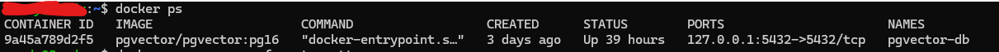
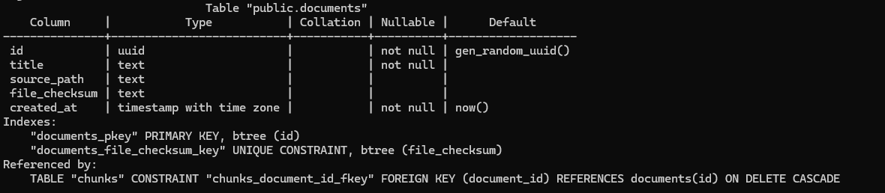
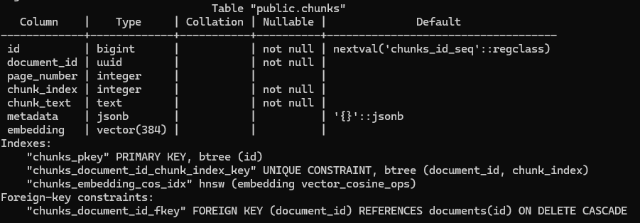
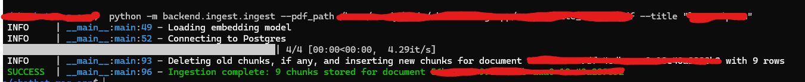
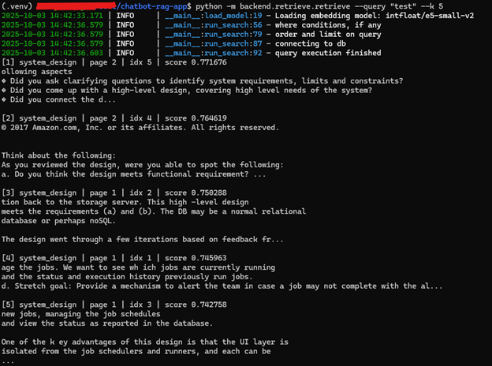

# Chatbot RAG App

This "Chat with your Docs" project lets you ask questions about your documents and get grounded answers with citations. It ingests files, splits them into manageable chunks, creates dense vector embeddings, and stores them in Postgres with the pgvector extension. At query time, it embeds the question, retrieves relevant passages via vector search, and composes an answer that quotes and links back to the sources.

This system is LLM agnostic and embedding model agnostic i.e., one can plug in OpenAI, local models, or other providers as needed, provided the embedding dimensions match the database schema. It is container-friendly, and designed for repeatable ingestion so that the knowledge base stays fresh as documents change. Chunking strategy (size/overlap), metadata, and indexing can be tuned for different document types, from long technical specs and handbooks to contracts, and research papers.

The model is under development. Ingestion is available for use and experimentation. Retrieval is compelte, Asking questions through is under progress.

## Features

1) PDF/text ingestion with deterministic chunking
2) Embeddings stored in Postgres via pgvector
3) Dockerized local stack
4) kNN retrieval with metadata filtering
5) Simple API for asking questions (coming soon)

## Repo structure

```bash
.
├─ backend/                 # App + scripts
│  ├─ app.py                # API entry (FastAPI/Flask) (coming soon)
│  ├─ db.py                 # DB connection & schema utils
│  ├─ chunker.py            # Text splitter
│  ├─ ingest.py             # Ingestion CLI
│  ├─ retrieval.py          # Vector search helpers
│  └─ requirements.txt
├─ docker/
│  └─ docker-compose.yml    # Postgres + pgvector service
├─ sample/                  # example docs for testing
└─ README.md
```

## Architecture

The RAG model broadly has 3 steps:
1) Ingestion: parse -> chunk -> embed -> write to Postgres
2) Retrieve: query -> vector search (pgvector) -> top-k chunks
3) Generate: LLM answer conditioned on retrieved chunks (with citations)

## Tech stack

1) Python 3.10+
2) Postgres 15+ with pgvector 0.7+ (HNSW requires pgvector ≥ 0.7)
3) Any embedding model (e5-small-v2, text-embedding-3-small, bge, etc.)
4) FastAPI + Uvicorn (future version)

## Environment variables

Create backend/.env from backend/.env.example

Keep .env out of git; commit only .env.example.


# Quickstart

## 1) Start the database (docker)

```bash
# From repo root
docker compose -f docker/docker-compose.yml up -d

# Confirm Postgres is up
docker ps
```



## 2) Create db and enable pgvector

```bash
# Shell into the container (psql)
docker exec -it pgvector-db psql -U postgres
```

then run queries to create db and extension 

```sql
CREATE DATABASE ragdb;
\c ragdb
CREATE EXTENSION IF NOT EXISTS vector;
```

## 3) Install backend dependencies

```bash
# having created the file structure as mentioned above
cd backend
python -m venv .venv && source .venv/bin/activate   # create a virtual environment
pip install -r requirements.txt
cp .env.example .env
```

## 4) Initialize schema

Either a or b

a) run the queries in psql. run in psql connected to ragdb (example schema)

```sql
CREATE TABLE IF NOT EXISTS documents (
  id UUID PRIMARY KEY,
  path TEXT,
  title TEXT,
  created_at TIMESTAMP DEFAULT NOW()
);

CREATE TABLE IF NOT EXISTS chunks (
  id UUID PRIMARY KEY,
  document_id UUID REFERENCES documents(id) ON DELETE CASCADE,
  ordinal INT,
  text TEXT,
  embedding vector(1536),   -- set to your model’s dimensions
  meta JSONB DEFAULT '{}'::jsonb
);
CREATE INDEX IF NOT EXISTS idx_chunks_embedding ON chunks USING hnsw (embedding vector_cosine_ops);
```

b) create a helper, say init_schema() with above queries, in db.py, then

```bash
python -c "import db; db.init_schema()"
```





## 5) Ingest sample file

```bash
cd backend
python -m backend.ingest.ingest --pdf_path ../sample/file_sample.pdf --doc-title "Sample file"
```



## 6) Retrieve chunks similar to query text

```bash
python -m backend.retrieve.retrieve --query "test" --k 5
```



# Usage tips

1) Keep chunk size 200-800 chars; overlap 10–20% is typical.
2) Match vector(N) to your embedding dimensions.
3) Add an HNSW index after loading some data: 
    CREATE INDEX ... USING HNSW ...;
    ANALYZE chunks;
