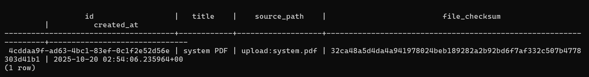

# Chat with Docs — Retrieval-Augmented Generation (RAG) Chatbot

An end-to-end backend system demonstrating how to **ground LLM queries on custom documents using semantic retrieval**.  
Built with **FastAPI**, **PostgreSQL + pgvector**, and **Docker**, this project highlights scalable API design, modular data pipelines, and containerized deployment.

The system is both **LLM-agnostic** and **embedding-model-agnostic** — you can plug in OpenAI, local models, or other providers as long as the embedding dimensions align with the database schema.  
It’s fully containerized and supports **repeatable ingestion**, ensuring the knowledge base stays current as documents evolve.  
Chunking parameters (size, overlap), metadata, and indexing are configurable for diverse document types — from technical manuals and contracts to research papers and handbooks.

---

## User Flow

1. Upload a PDF file through the `/ingest` API.  
2. The system splits it into text chunks, generates embeddings using `intfloat/e5-small-v2`, and stores them in PostgreSQL (pgvector).  
3. Query through `/search` with any question.  
4. The API retrieves top-k relevant chunks ranked by cosine similarity.

Result → Contextual document retrieval ready for downstream LLM or chatbot integration.

---

## Architecture

The system runs locally via Docker Compose with two services:

| Service      | Description |
|--------------|-------------|
| **postgres** | PostgreSQL 15 with `pgvector` extension enabled |
| **backend**  | FastAPI app exposing ingestion, search, and health endpoints |

**Data Flow:**
`PDF → Chunker → Embedding Model → pgvector DB → Query Retrieval via FastAPI`

---

## Features

- **Document Ingestion** – Upload and embed documents into pgvector
- **Semantic Search** – Retrieve top-k contextually similar chunks
- **Health Endpoint** – Validates DB connectivity and uptime
- **Containerized Setup** – Reproducible build using Docker Compose
- **Extensible Design** – Modular components for easy LLM integration

---

## Engineering Highlights

- Implemented modular ingestion and retrieval pipelines using FastAPI.
- Optimized vector search with `pgvector` cosine similarity for low-latency retrieval.
- Containerized backend and database for isolated, reproducible development.
- Structured code for future `/answer` LLM route integration.
- Added logging, environment-driven configuration, and health monitoring endpoints.

---

## Repo structure

```bash
chatbot-rag-app/
├─ backend/
│  ├─ .env.example
│  ├─ Dockerfile
│  ├─ requirements.txt
│  ├─ requirements.lock.txt
│  ├─ app/
│  │  └─ app.py                 # FastAPI entrypoint
│  ├─ db/
│  │  ├─ db.py                  # psycopg2 connection + helpers
│  │  └─ test_db.py
│  ├─ chunker/
│  │  └─ chunker.py             # PDF/text chunking
│  ├─ embeddings/
│  │  └─ embeddings.py          # Model loader: intfloat/e5-small-v2
│  ├─ ingest/
│  │  └─ ingest.py              # Ingestion pipeline (store docs/chunks)
│  └─ retrieve/
│     └─ retrieve.py            # Semantic search / similarity logic
├─ docker/
│  ├─ docker-compose.yml
│  └─ init/
│     ├─ init.sql               # schema bootstrap
│     └─ once-suser.sql         # one-time user/role setup
├─ helper_images/               # screenshots/diagrams for README
│  └─ *.png
├─ sample/
│  └─ *.pdf
├─ .gitignore
└─ README.md
```

---

## Tech stack

|       Category       |                  Tools                |
|----------------------|---------------------------------------|
|     **Language**     |               Python 3.11             |
|     **Framework**    |                 FastAPI               |
|     **Database**     |          PostgreSQL + pgvector        |
|  **Embedding Model** | `intfloat/e5-small-v2` (Hugging Face) |
| **Containerization** |                 Docker                |

---

## Quickstart

These steps assume Docker(and Docker compose) are installed and you have a `.env` file for credentials.

### 1) Clone this repository

```bash
git clone https://github.com/Sandeep011/chatbot-rag-app.git
cd chatbot-rag-app
```

### 2) Configure environment variables

Create a `.env` file in the repo root:

```bash
PG_HOST=postgres
PG_PORT=5432
PG_USER=postgres
PG_PASSWORD=<your_password>
PG_DATABASE=chatbot
```

`.env` should be git-ignored. to prevent sharing secrets.

### 3) Build Docker images (First time only)

```bash
docker compose -f docker/docker-compose.yml build
```

This builds:
- chatbot-backend (FastAPI app)


For chatbot-db (PostgreSQL + pgvector), we use an image provided by docker.
We can reference and directly launch it.

### 4) Launch the app

```bash
docker compose -f docker/docker-compose.yml up
```
This starts both containers, sets networking, applies DB init (if mounted).


### 5) Verify health

```bash
curl -s http://127.0.0.1:8000/health | jq
```

This should return:
```json
{"status":"OK","model":"intfloat/e5-small-v2"}
```


### 6) Ingest a document

```bash
curl -X POST "http://127.0.0.1:8000/ingest" \
  -F "file=@sample/sample.pdf" \
  -F "title=Sample PDF"
```
This chunks the PDF, generates embeddings (e5-small-v2), and stores vectors in Postgres (pgvector).





### 7) Run a search query

```bash
curl -X POST "http://127.0.0.1:8000/search" \
  -H "Content-Type: application/json" \
  -d '{"query":"your query"}'
```

Sample response:

```json
{
  "query": "system design",
  "results": [
    {"chunk":"System deisgn is the architecture of services and...","score":0.88}
  ]
}
```


### 8) Stop the app

```bash
docker compose -f docker/docker-compose.yml down
```


## Current Status

- Dockerized backend + pgvector DB
- ingest, /search, /health working
- .env excluded from git
- Local run validated end-to-end

## Planned Enhancements

- **Deployment:** Azure Container Apps + Azure PostgreSQL Flexible Server
- **Scalability:** Async I/O for ingestion/search paths
- **Observability:** Metrics + structured logs
- **LLM Layer:** /answer endpoint for contextual answers
- **UI:** Minimal textbox front end for live demo

## Usage Tips
- **Startup:** Always run `docker compose up` from the repo root.
- **Ingestion:** Prefer small PDFs (<10 MB) for faster chunking.
- **DB Persistence:** Data is stored in the `chatbot` database; use `docker exec -it postgres psql` to inspect.
- **Reset:** Run `docker compose down -v` to clear data volumes completely. THIS WIPES THE DATABASE AND DELETES THE IMAGES.

### Common Pitfalls
- Forgetting to rebuild after changing dependencies → `docker compose build --no-cache`
- Missing `.env` values cause `/health` to return 500
